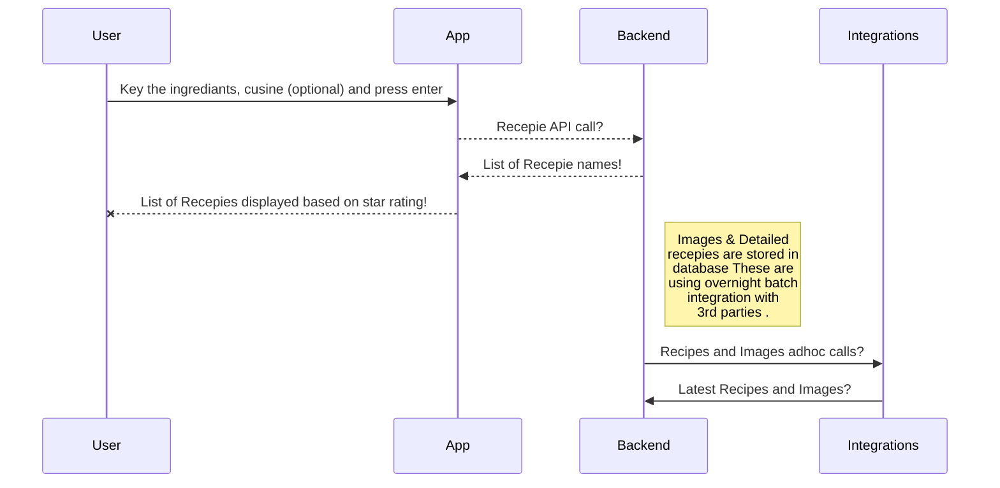

# What to eat today

A small handy easy to use to app, that help you decide what food you can make today based on ingredients you have.

## Features (as Phase 1 / 2)

 - Suggest food suggestions 
    - based on ingredients available
    - suggest what you can get from your nearest store
    - suggest based on your food pattern and likes
    - Will tell what food / ingrediants you still have in house hinding somewhere hence reducing wastage.
 - Store your food inventory
 - Suggest based on your history
 - You can bookmark recepies
 - Create your own recopies and share with fellow app users
 ## UML Diagrams
figure 1 - Recipe Search

 *figure 2 - Adding ingredients available at home* 
 *figure 3 - User Login and storing user specific data*
 
 ## Technology
 
 1. Frontend (React Based App)
  - Takes ingredients as input
  - Option to feed ingrediants availble at home
  - Personalized Login with google / fb / github or personal user id
  - Option to add in favorites
  - display food item name, cuisine, popularity and recipe details
 2. Backend APIs (Node Js based BFF application)
  - Post data to frontend app based on input received
  - Store the user search, favorites, ingredient details
 3. NoSQL DB
  - user data
  - recipe data
  - user house ingredient data
 4. Integration
  - Google / FB / github oauth
  - Recepies integration
  - food images 
 5. API Management
 6. CDN for image and static content
 
 ## Target Audience & usgae
 1. General Public day to day usage
 
 ## Target Revenue
 
